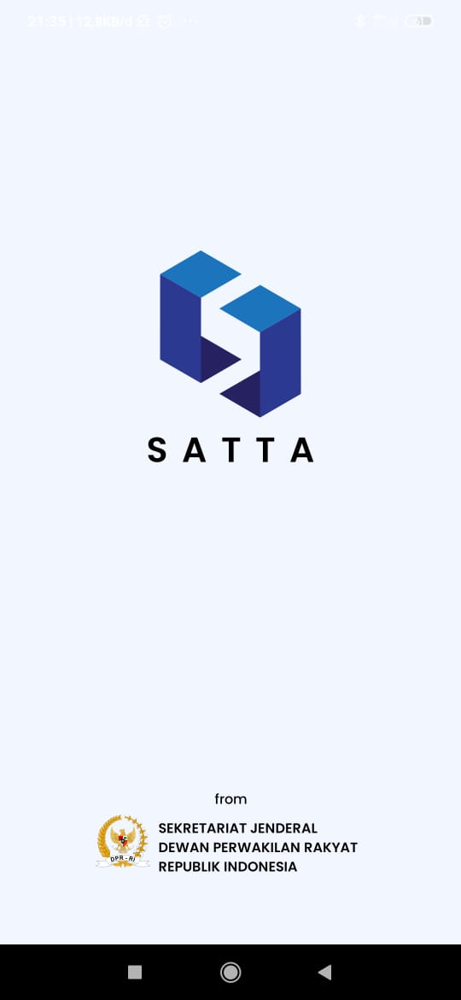
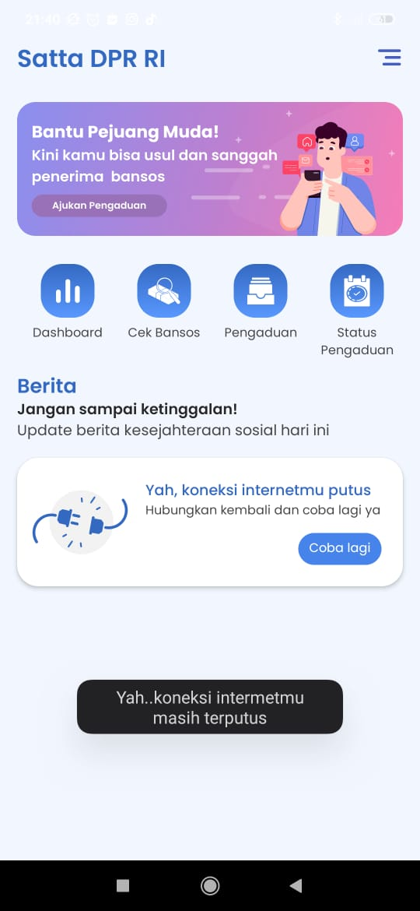
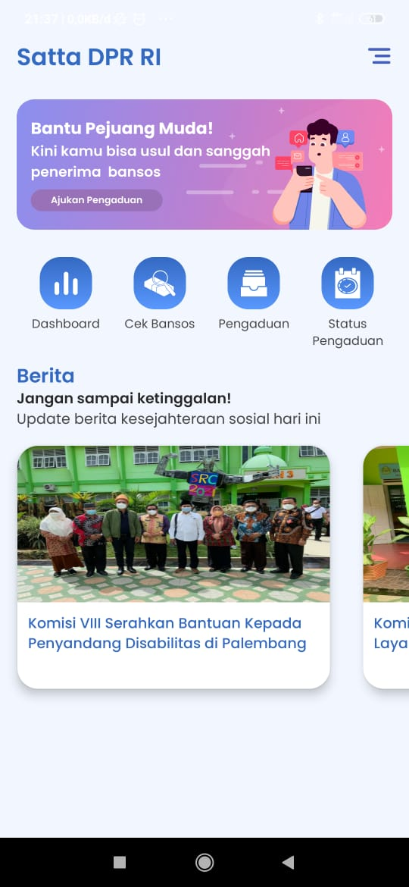
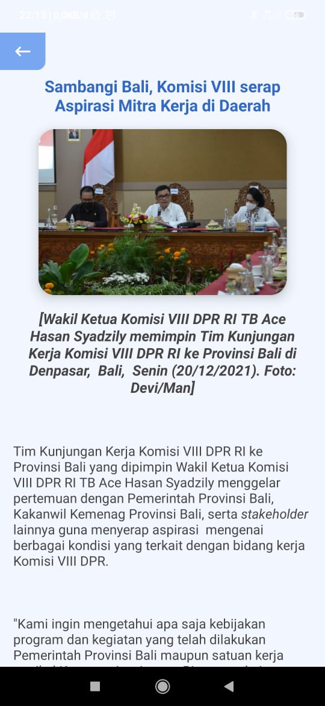
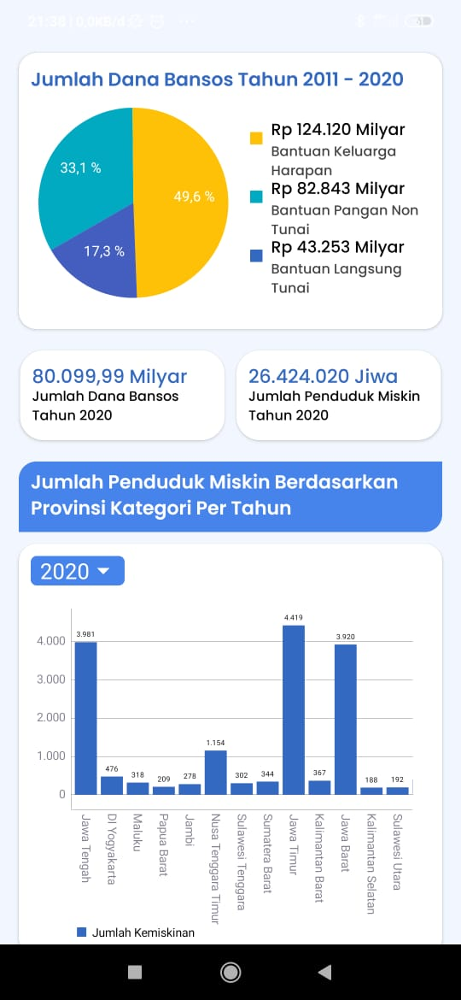
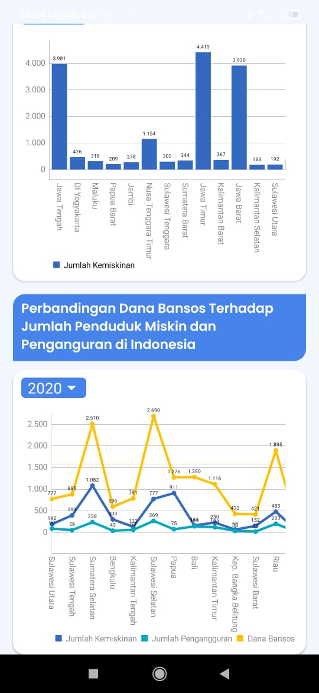
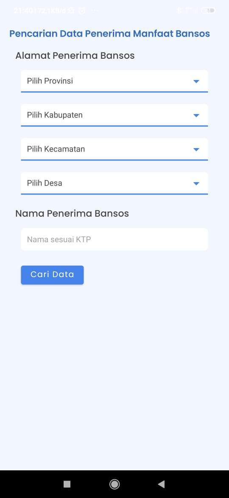
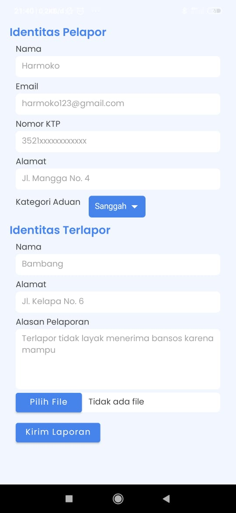
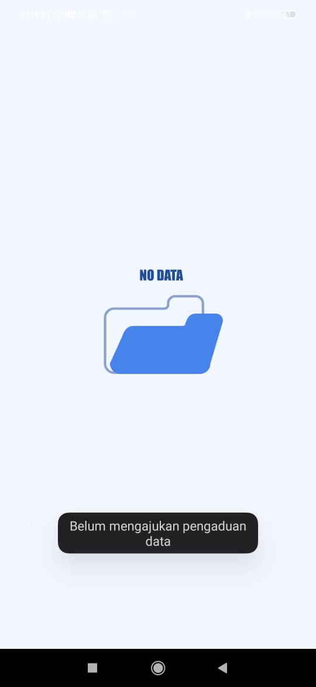

Prototype Dashboard Satu Data 
==

You can try this app https://drive.google.com/file/d/1-rLL6-Qt1mW5Yw9KQ9c9sbFKzvbDSJSH/view?usp=sharings        

The Architecture
--
- Clean Architecture

Library in use
--
- Retrofit2: Converter Gson
- Retrofit2: Converter Simplexml
- RxJava3
- MPAndroidChart
- Lottie
- Glide

<h3 align="center"> Demo App </h3>

    
        
    
    
    
    
    
    

